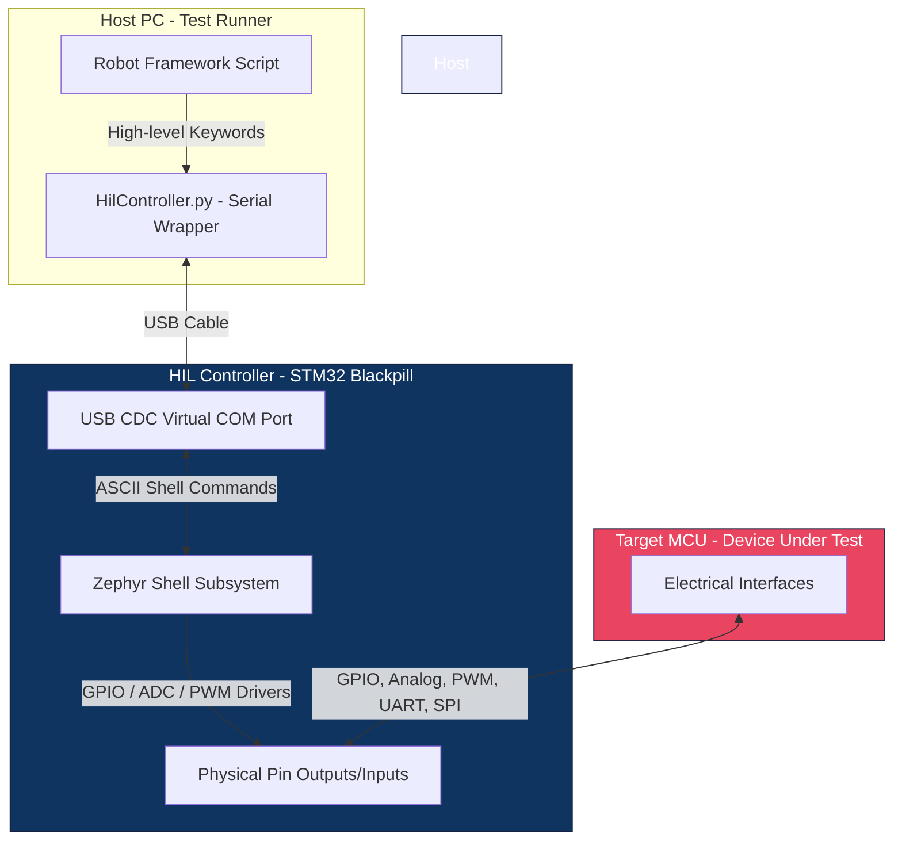

# Pix-in-the-Loop (PIL)

**Pix-in-the-Loop (PIL)** is a high-performance, modular Hardware-in-the-Loop (HIL) testing platform. It bridges the gap between high-level test automation on a PC and real-time physical stimulation on embedded targets.

By pairing the highly readable, keyword-driven **Robot Framework** on the host PC with a deterministic **Zephyr RTOS** controller running on an **STM32F401 Blackpill**, PIL delivers a flexible, robust, and cost-effective test environment. This architecture allows developers and QA teams to run complex hardware integration and validation suites with automated, color-coded HTML report generation.

---

## System Architecture

PIL decouples high-level test logic from real-time electrical stimulus. The platform is divided into three distinct layers:

1. **The Test Runner (PC):** Runs Robot Framework. It parses readable `.robot` files, sends serialized ASCII commands to the Zephyr HIL Controller, monitors return signals, asserts expected behaviors, and compiles a comprehensive HTML log/report.
2. **The HIL Controller (Zephyr RTOS + Blackpill):** Acts as a smart hardware-to-software I/O bridge. It runs Zephyr's interactive **Shell Subsystem** over **USB CDC (Serial)**. It takes parameterized ASCII commands (e.g., `hil gpio_set A 8 1`), executes them directly using bare-metal HAL/drivers, and responds back immediately.
3. **The Target MCU (Device Under Test - DUT):** The system undergoing testing. The DUT is completely oblivious to the testing framework; it simply reacts to physical electrical signals (analog, digital, PWM, serial) provided or measured by the HIL Controller.

---

## Hardware & Pin Allocation Matrix

To maximize the capabilities of the **STM32F401 Blackpill** while protecting critical debugging and communication lines, specific pins have been reserved. The remaining pins are multiplexed to serve as a high-density, multi-protocol I/O hub.

| Peripheral | Pin Assignment | Signal Type | Description |
| :--- | :--- | :--- | :--- |
| **System (Reserved)** | PA11, PA12, PA13, PA14 | Debug & USB | SWD Debugging (SWDIO/SWCLK) and USB CDC Serial connection. |
| **USART1** | PA9 (TX), PA10 (RX) | Digital Serial | High-speed primary UART channel to the DUT. |
| **USART2** | PA2 (TX), PA3 (RX)* | Digital Serial | Secondary UART channel to the DUT (*Shared with ADC1_IN2 / ADC1_IN3). |
| **SPI1** | PA5 (SCK), PA6 (MISO), PA7 (MOSI)* | SPI Bus | Primary SPI bus (*Shared with ADC1_IN5 / ADC1_IN6 / ADC1_IN7). |
| **SPI2** | PB13 (SCK), PB14 (MISO), PB15 (MOSI) | SPI Bus | Secondary SPI bus for peripherals. |
| **ADC1 (Dedicated)** | PA1 (IN1), PA4 (IN4), PB0 (IN8), PB1 (IN9) | Analog Input | 4 dedicated analog measurement channels (12-bit, 0-3.3V) with no protocol overlap. |
| **ADC1 (Shared Pins)** | PA0 (IN0), PA2 (IN2), PA3 (IN3), PA5 (IN5), PA6 (IN6), PA7 (IN7) | Analog Input | Up to 6 additional channels, available if their corresponding PWM/UART/SPI functions are unused. |
| **PWM (Independent)** | PA8 (PWM1), PA0 (PWM2)*, PB4 (PWM3), PB6 (PWM4) | Timed Output | 4 independent hardware PWM timers (*PWM2 PA0 is shared with ADC1_IN0). |
| **Pure GPIO** | PA15, PB2, PB3, PB5, PB10, PB12, PC13, PC14, PC15 | Digital I/O | 9 dedicated digital pins for discrete output stimulation or input sensing. |

> [!IMPORTANT]  
> **Pin-Multiplexing Restrictions (Hardware Overlaps):**
>
> * Using **PA0** for **PWM2** will make **ADC1_IN0** unavailable.
> * Using **PA2** for **UART2** will make **ADC1_IN2** unavailable.
> * Using **PA3** for **UART2** will make **ADC1_IN3** unavailable.
> * Using **PA5** for **SPI1** will make **ADC1_IN5** unavailable.
> * Using **PA6** for **SPI1** will make **ADC1_IN6** unavailable.
> * Using **PA7** for **SPI1** will make **ADC1_IN7** unavailable.

---
